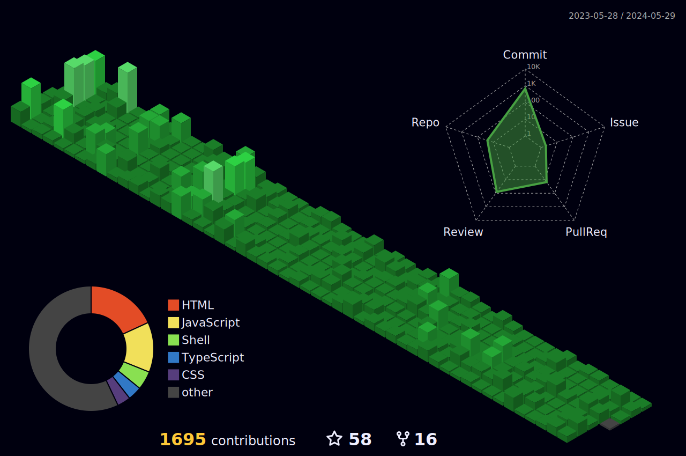

<h3 align="center">Social Media</h3>

    &nbsp;&nbsp;
    &nbsp;&nbsp;
    <!--  -->

<h3 align="center">GitHub Trophies</h3>

<h3 align="center">GitHub Stats</h3>

    
    
    
    

    
    &nbsp;&nbsp;
    

 
<h1 align=center>

:open_book: :books: Trying out :closed_book: :desktop_computer:

</h1>
<h1>Platform:&nbsp;&nbsp;
    <!-- &nbsp;&nbsp; -->
    &nbsp;&nbsp;
    &nbsp;&nbsp;
</h1>

<h1>Languages:&nbsp;&nbsp;
    &nbsp;&nbsp;
    &nbsp;&nbsp;
    &nbsp;&nbsp;
    &nbsp;&nbsp;
    &nbsp;&nbsp;
    &nbsp;&nbsp;
    &nbsp;&nbsp;
</h1>

<h1>Frontend or UI/UX
    &nbsp;&nbsp;
</h1>

<!-- <h1>Backend:&nbsp;&nbsp;
    &nbsp;&nbsp;
    &nbsp;&nbsp;
    &nbsp;&nbsp;
</h1> -->

<h1>Database:&nbsp;&nbsp;
    &nbsp;&nbsp;
    &nbsp;&nbsp;
</h1>

<h1>Cloud:&nbsp;&nbsp;
    &nbsp;&nbsp;
</h1>

<!-- <h1>DevOps:&nbsp;&nbsp;
    &nbsp;&nbsp;
    &nbsp;&nbsp;
    &nbsp;&nbsp;
    &nbsp;&nbsp;
    &nbsp;&nbsp;
</h1> -->
  
<!-- <h1 align=center>Experience</h1>

<!-- 

| Role               | Organisation                                        | Time Period        | Type       |
| ------------------ | --------------------------------------------------- | ------------------ | ---------- |
| Frontend Engineer |   | Jun 2023 - Present | Internship | -->

<!-- 
 --> 

  
<!-- 

    

 -->

